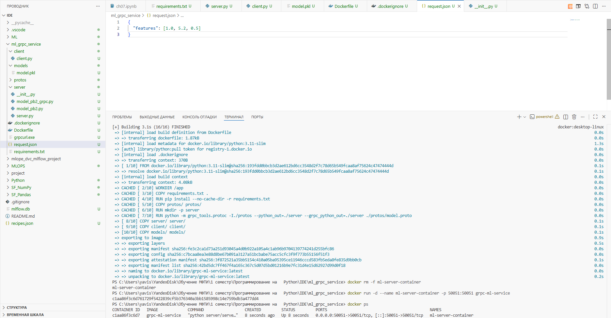
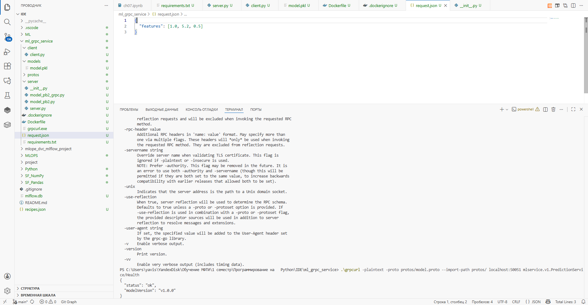
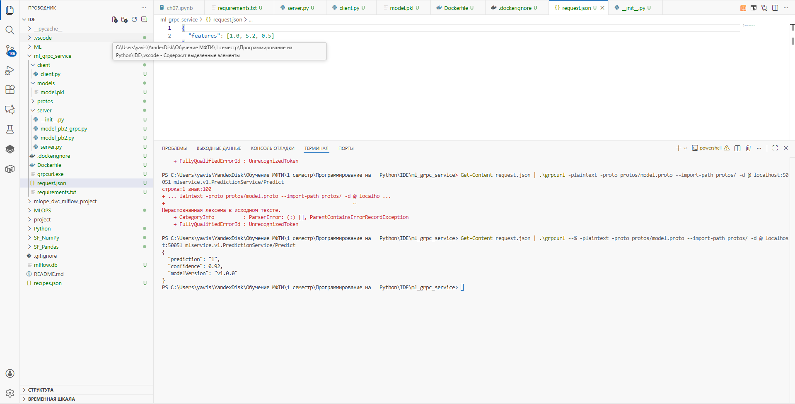

# Сервис машинного обучения (ML) с использованием gRPC и Docker

## 📝 Краткое описание проекта

Проект представляет собой микросервис для предоставления предсказаний машинного обучения (ML) по протоколу **gRPC**. 

Сервис реализован на **Python** с использованием библиотеки `grpcio` и контейнеризирован с помощью **Docker**, что обеспечивает его изолированный запуск и масштабируемость.

Сервис предоставляет два основных gRPC-метода:
1.  **Health**: Проверка работоспособности сервиса и версии загруженной модели.
2.  **Predict**: Принимает на вход набор признаков (`features`) и возвращает предсказание (`prediction`) и уверенность (`confidence`) модели.

В текущей реализации, из-за отсутствия обученной модели, сервис загружает **модель-заглушку** (`DummyModel`), что позволяет проверить корректность работы gRPC-интерфейса и логики обработки данных.

## 🛠️ Команды сборки и запуска

Все команды выполняются из корневой директории проекта `ml_grpc_service/`.

### 1. Сборка Docker-образа

Команда собирает Docker-образ с именем `grpc-ml-service` на основе инструкций в `Dockerfile`.

```bash
docker build -t grpc-ml-service .

2. Запуск Docker-контейнера
Команда запускает контейнер в фоновом режиме (-d), присваивает ему имя ml-server-container и пробрасывает порт 50051 для доступа извне.
docker rm -f ml-server-container # Удаление предыдущего контейнера, если он существует
docker run -d --name ml-server-container -p 50051:50051 grpc-ml-service

3. Проверка статуса контейнера
Убедитесь, что контейнер запущен и находится в статусе Up.
docker ps

Примеры вызовов сервиса (с использованием grpcurl)
Для тестирования используется утилита grpcurl с указанием локального .proto файла, поскольку сервер не реализует API рефлексии. Для выполнения команд используется синтаксис PowerShell.

1. Вызов метода /Health (Проверка работоспособности)
Проверяет, что сервер работает и возвращает версию модели.

.\grpcurl -plaintext -proto protos/model.proto --import-path protos/ localhost:50051 mlservice.v1.PredictionService/Health

Ожидаемый вывод: {
  "status": "ok",
  "modelVersion": "v1.0.0"
}

2. Вызов метода /Predict (Получение предсказания)
Перед выполнением команды необходимо создать файл request.json со структурой запроса (пример ниже).

Содержимое request.json:{
  "features": [1.0, 5.2, 0.5]
}

Команда вызова (с использованием конвейера PowerShell):
Get-Content request.json | .\grpcurl -plaintext -proto protos/model.proto --import-path protos/ -d @ localhost:50051 mlservice.v1.PredictionService/Predict

Ожидаемый вывод:
{
  "prediction": "1",
  "confidence": 0.92,
  "modelVersion": "v1.0.0"
}








